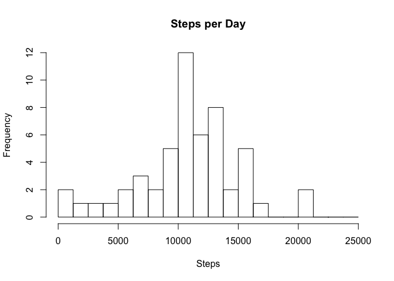
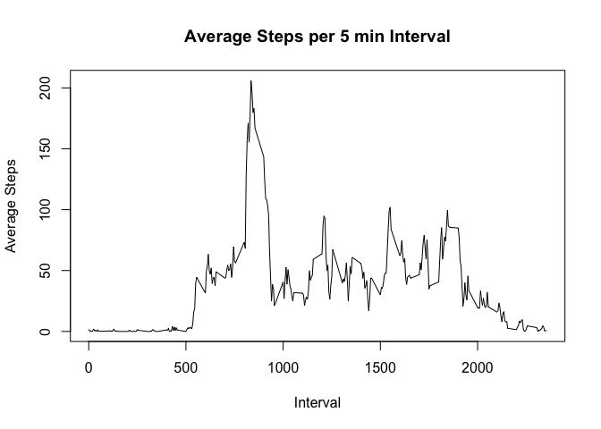

# Reproducible Research: Peer Assessment 1

## Loading and preprocessing the data

In this assignment, we use data that has been provided anonymously from a personal activity monitoring device.  That data can be downloaded [here](https://d396qusza40orc.cloudfront.net/repdata%2Fdata%2Factivity.zip).

Once the data has been downloaded and extracted into the Downloads folder, the "activity.csv" file is read using the read.csv function to create a data frame that will be the basis of this analysis.


```r
PersonalActivity<-read.csv(file="~/Downloads/activity.csv")
```

## What is mean total number of steps taken per day?

First, we'll compute the mean number of steps taken per day with all NAs removed.


```r
mean(PersonalActivity$steps,na.rm=TRUE)
```

```
## [1] 37.3826
```

Next, let's look at a distribution of all steps taken per day for each day represented in the data set.


```r
StepsPerDay<-aggregate(steps~date,PersonalActivity,sum)[,"steps"]
hist(StepsPerDay,breaks=seq(0,25000,1250),main="Steps per Day", xlab="Steps")
```

 

## What is the average daily activity pattern?


```r
plot(aggregate(steps~interval,PersonalActivity,mean),type="l",main="Average Steps per 5 min Interval",ylab="Average Steps",xlab="Interval")
```

 

## Imputing missing values


## Are there differences in activity patterns between weekdays and weekends?
